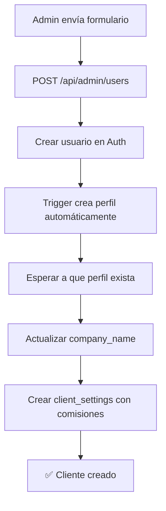

# 📚 Guía Completa: Sistema Multi-Tenant de Clientes

## 🎯 Visión General

Este sistema permite que **Lify Vending** (Admin) gestione múltiples clientes (hoteles, bares, etc.) y cada cliente solo vea la recaudación de **sus máquinas asignadas**.

## 📋 Flujo Completo: De Cero a Cliente Funcional

### **Paso 1: Admin Crea el Cliente**

**Ubicación:** Admin → Gestión de Clientes → Nuevo Cliente

**Datos a completar:**
```
✉️  Email:                cliente@hotel.com
🔒 Password:              contraseña123
👤 Nombre del Contacto:   Juan García
🏢 Empresa:               Hotel Playa S.L.
🔢 % Oculto:              30    (qué % de recaudación NO ve el cliente)
💰 % Comisión:            15    (qué % se queda Lify como comisión)
```

**¿Qué pasa internamente?**



**Logs esperados:**
```log
[CREATE-CLIENT] Datos recibidos RAW: {...}
[CREATE-CLIENT] Esperando a que el trigger cree el perfil...
[CREATE-CLIENT] Intento 1/5 - esperando perfil...
[CREATE-CLIENT] ✅ Perfil creado por el trigger
[CREATE-CLIENT] Creando settings con % Oculto: 30 % Comisión: 15
[CREATE-CLIENT] ✅ Settings guardados en BD
[CLIENT-CREATED] Cliente creado: {id: "...", email: "..."}
```

---

### **Paso 2: Admin Asigna Máquinas al Cliente**

**Ubicación:** Admin → Gestión de Clientes → [Ver Cliente] → Asignación de Máquinas

**¿Qué máquinas puedo asignar?**
- Solo máquinas que **ya existen** en la tabla `machines`
- Las máquinas se crean automáticamente con el **scraper**
- El scraper obtiene datos de Orain, Televend, Frekuent, etc.

**Proceso:**
1. El admin ve una lista de TODAS las máquinas disponibles
2. Marca las que pertenecen al cliente (ej: máquinas en su hotel)
3. Guarda los cambios
4. Se crean registros en `client_machine_assignments`

**Ejemplo:**
```
Cliente: Hotel Playa S.L.
Máquinas asignadas:
  ✅ MAQ-001 - Recepción
  ✅ MAQ-002 - Cafetería
  ✅ MAQ-003 - Gimnasio
```

---

### **Paso 3: Scraper Obtiene Recaudaciones**

**¿Cómo se ejecuta?**
- **Automático:** Cron job cada X horas
- **Manual:** Admin → Panel → "Actualizar Recaudaciones"

**Proveedores soportados:**
- 🟢 **Orain** (scraper completo)
- 🟢 **Televend** (scraper completo)
- 🟡 **Frekuent** (integración parcial)

**¿Qué hace el scraper?**
1. Login en el dashboard del proveedor (Orain/Televend)
2. Navega a la lista de máquinas
3. Extrae datos de recaudación por máquina
4. Guarda en `machine_revenue_snapshots`

**Datos extraídos:**
```javascript
{
  machine_id: "uuid-de-la-maquina",
  period: "daily" | "weekly" | "monthly",
  amount_gross: 145.50,        // Recaudación bruta total
  anonymous_total: 145.50,     // Total anónimo (sin desglose)
  anonymous_card: 80.00,       // Pago con tarjeta
  anonymous_cash: 65.50,       // Pago en efectivo
  scraped_at: "2026-05-05T10:30:00Z"
}
```

---

### **Paso 4: Cliente Inicia Sesión**

**URL:** `https://tu-dominio.com/login`

**Credenciales:**
```
Email:    cliente@hotel.com
Password: contraseña123
```

**¿Qué ve el cliente?**

```
┌─────────────────────────────────────────────┐
│         Portal Cliente - Hotel Playa        │
├─────────────────────────────────────────────┤
│                                             │
│  📊 Dashboard                               │
│  ├─ Recaudación Total (hoy):  €245.30      │
│  ├─ Recaudación Neta:         €171.71 *    │
│  └─ Máquinas Activas:         3            │
│                                             │
│  🏪 Mis Máquinas                            │
│  ├─ MAQ-001 - Recepción       €95.20       │
│  ├─ MAQ-002 - Cafetería       €105.50      │
│  └─ MAQ-003 - Gimnasio        €44.60       │
│                                             │
│  * Después de comisión del 30%             │
└─────────────────────────────────────────────┘
```

**¿Qué NO ve el cliente?**
- ❌ Otras máquinas del sistema
- ❌ Recaudación de otros clientes
- ❌ Panel de administración
- ❌ El % exacto de comisión (solo ve el neto)

---

## 🔐 Seguridad: Row Level Security (RLS)

### **Políticas Activas**

#### **Tabla `profiles`**
```sql
-- Cliente solo ve su propio perfil
CREATE POLICY "Clients can view own profile" ON profiles
    FOR SELECT USING (id = auth.uid() AND role = 'client');

-- Admin ve todos los perfiles
CREATE POLICY "Admins can view all profiles" ON profiles
    FOR SELECT USING (
        EXISTS (SELECT 1 FROM profiles WHERE id = auth.uid() AND role = 'admin')
    );
```

#### **Tabla `machines`**
```sql
-- Cliente solo ve sus máquinas asignadas
CREATE POLICY "Clients can view assigned machines" ON machines
    FOR SELECT USING (
        EXISTS (
            SELECT 1 FROM client_machine_assignments
            WHERE client_id = auth.uid() AND machine_id = machines.id
        )
    );

-- Admin ve todas las máquinas
CREATE POLICY "Admins can manage all machines" ON machines
    FOR ALL USING (
        EXISTS (SELECT 1 FROM profiles WHERE id = auth.uid() AND role = 'admin')
    );
```

#### **Tabla `machine_revenue_snapshots`**
```sql
-- Cliente solo ve recaudación de sus máquinas
CREATE POLICY "Clients can view assigned revenue" ON machine_revenue_snapshots
    FOR SELECT USING (
        EXISTS (
            SELECT 1 FROM client_machine_assignments
            WHERE client_id = auth.uid() AND machine_id = machine_revenue_snapshots.machine_id
        )
    );
```

---

## 💰 Sistema de Comisiones

### **Dos tipos de porcentajes:**

1. **`commission_hide_percent`** - % Oculto
   - Se descuenta de la recaudación bruta
   - El cliente NO ve este porcentaje
   - Se usa para calcular el neto que ve el cliente
   - Ejemplo: 30% → Cliente ve solo el 70%

2. **`commission_payment_percent`** - % Comisión Real
   - El % que Lify cobra realmente
   - Se usa para generar reportes de pagos
   - Se usa para generar facturas
   - Ejemplo: 15% → Lify cobra €15 por cada €100

### **Ejemplo de Cálculo:**

```javascript
// Máquina recaudó €100 hoy
const recaudacionBruta = 100.00;

// % Oculto: 30%
const porcentajeOculto = 30;
const netoCliente = recaudacionBruta * (1 - porcentajeOculto / 100);
// = 100 * 0.70 = €70.00 (esto ve el cliente)

// % Comisión Real: 15%
const porcentajeComision = 15;
const comisionLify = recaudacionBruta * (porcentajeComision / 100);
// = 100 * 0.15 = €15.00 (esto cobra Lify)

// Pago final al cliente = Bruto - Comisión
const pagoCliente = recaudacionBruta - comisionLify;
// = 100 - 15 = €85.00
```

**¿Por qué dos porcentajes?**
- El cliente espera ver un neto más bajo (70%)
- Pero Lify solo cobra la comisión pactada (15%)
- La diferencia (15%) puede ser para margen, gastos, etc.

---

## 🗄️ Estructura de Base de Datos

### **Tablas Principales**

```sql
-- 1. Autenticación (gestionada por Supabase)
auth.users (
    id UUID PRIMARY KEY,
    email TEXT,
    encrypted_password TEXT,
    raw_user_meta_data JSONB
)

-- 2. Perfiles de Usuario
profiles (
    id UUID PRIMARY KEY REFERENCES auth.users(id),
    role user_role NOT NULL,  -- 'admin' | 'client' | 'operador'
    email TEXT UNIQUE,
    display_name TEXT,
    company_name TEXT,
    created_at TIMESTAMPTZ,
    updated_at TIMESTAMPTZ
)

-- 3. Configuración de Cliente
client_settings (
    id UUID PRIMARY KEY,
    client_id UUID REFERENCES profiles(id),
    commission_hide_percent NUMERIC(5,2),    -- 0-100
    commission_payment_percent NUMERIC(5,2), -- 0-100
    created_at TIMESTAMPTZ,
    updated_at TIMESTAMPTZ,
    UNIQUE(client_id)
)

-- 4. Máquinas de Vending
machines (
    id UUID PRIMARY KEY,
    name TEXT NOT NULL,
    machine_id TEXT,           -- ID externo (Orain, Televend)
    location TEXT,
    provider TEXT,             -- 'orain' | 'televend' | 'frekuent'
    last_scraped_at TIMESTAMPTZ,
    created_at TIMESTAMPTZ,
    updated_at TIMESTAMPTZ
)

-- 5. Asignaciones Cliente-Máquina
client_machine_assignments (
    id UUID PRIMARY KEY,
    client_id UUID REFERENCES profiles(id),
    machine_id UUID REFERENCES machines(id),
    assigned_at TIMESTAMPTZ,
    UNIQUE(client_id, machine_id)
)

-- 6. Snapshots de Recaudación
machine_revenue_snapshots (
    id UUID PRIMARY KEY,
    machine_id UUID REFERENCES machines(id),
    period revenue_period,     -- 'daily' | 'weekly' | 'monthly'
    amount_gross NUMERIC(10,2),
    anonymous_total NUMERIC(10,2),
    anonymous_card NUMERIC(10,2),
    anonymous_cash NUMERIC(10,2),
    scraped_at TIMESTAMPTZ,
    created_at TIMESTAMPTZ
)
```

---

## 🔧 APIs Disponibles

### **Admin APIs**

#### **1. Crear Cliente**
```http
POST /api/admin/users
Authorization: Bearer {token}
Content-Type: application/json

{
  "email": "cliente@hotel.com",
  "password": "contraseña123",
  "displayName": "Juan García",
  "companyName": "Hotel Playa S.L.",
  "commissionHidePercent": 30,
  "commissionPaymentPercent": 15
}
```

#### **2. Listar Clientes**
```http
GET /api/admin/clients
Authorization: Bearer {token}
```

#### **3. Asignar Máquinas**
```http
POST /api/admin/clients/{clientId}/machines
Authorization: Bearer {token}
Content-Type: application/json

{
  "machineIds": ["uuid1", "uuid2", "uuid3"]
}
```

#### **4. Ejecutar Scraper**
```http
POST /api/admin/scrape
Authorization: Bearer {token}
Content-Type: application/json

{
  "provider": "orain" | "televend" | "all"
}
```

### **Client APIs**

#### **1. Ver Mis Máquinas**
```http
GET /api/client/machines
Authorization: Bearer {token}
```

#### **2. Ver Mi Recaudación**
```http
GET /api/client/revenue
Authorization: Bearer {token}
Query params: ?period=daily&from=2026-05-01&to=2026-05-05
```

---

## 🚨 Troubleshooting Común

### **Problema: "Clientes encontrados: 0"**

**Causa:** Los perfiles no se crearon correctamente

**Solución:**
```sql
-- Ver usuarios sin perfil
SELECT au.id, au.email
FROM auth.users au
LEFT JOIN public.profiles p ON au.id = p.id
WHERE p.id IS NULL;

-- Crear perfiles faltantes
INSERT INTO public.profiles (id, email, role, display_name)
SELECT au.id, au.email, 'client'::user_role, au.email
FROM auth.users au
LEFT JOIN public.profiles p ON au.id = p.id
WHERE p.id IS NULL
ON CONFLICT (id) DO NOTHING;
```

### **Problema: Cliente no ve ninguna máquina**

**Verificar asignaciones:**
```sql
SELECT 
    p.email as cliente,
    m.name as maquina,
    m.location
FROM client_machine_assignments cma
JOIN profiles p ON p.id = cma.client_id
JOIN machines m ON m.id = cma.machine_id
WHERE p.email = 'cliente@hotel.com';
```

**Si está vacío:**
- El admin no ha asignado máquinas todavía
- Las máquinas no existen en la BD (ejecutar scraper primero)

### **Problema: Scraper no encuentra máquinas**

**Verificar credenciales:**
```bash
# En .env.local
ORAIN_USERNAME=tu-usuario
ORAIN_PASSWORD=tu-contraseña
TELEVEND_USERNAME=tu-usuario
TELEVEND_PASSWORD=tu-contraseña
```

**Ejecutar en modo debug:**
```bash
npm run scrape:debug
# o
node scraper/dashboard-scraper.ts
```

---

## 📊 Monitoreo y Logs

### **Logs Importantes**

**Creación de cliente:**
```log
[CREATE-CLIENT] Datos recibidos RAW: {...}
[CREATE-CLIENT] Esperando a que el trigger cree el perfil...
[CREATE-CLIENT] ✅ Perfil creado
[CREATE-CLIENT] Creando settings con % Oculto: 30 % Comisión: 15
[CREATE-CLIENT] ✅ Settings guardados
```

**Scraper:**
```log
[SCRAPER] Iniciando scrape de Orain...
[SCRAPER] Login exitoso
[SCRAPER] Máquinas encontradas: 15
[SCRAPER] Procesando: MAQ-001 - Recepción
[SCRAPER] ✅ 15 máquinas actualizadas
```

**Autenticación:**
```log
[AUTH] Cliente cliente@hotel.com inició sesión
[AUTH] Cargando máquinas asignadas...
[AUTH] Máquinas encontradas: 3
```

---

## 🎓 Mejores Prácticas

### **1. Creación de Clientes**

✅ **HACER:**
- Usar emails reales para que puedan resetear password
- Establecer comisiones claras desde el inicio
- Asignar máquinas inmediatamente después de crear

❌ **NO HACER:**
- Crear clientes sin asignar máquinas (quedarán sin datos)
- Usar porcentajes > 100%
- Duplicar emails (fallará)

### **2. Asignación de Máquinas**

✅ **HACER:**
- Verificar que las máquinas existan primero (ejecutar scraper)
- Asignar máquinas por ubicación física del cliente
- Revisar periódicamente las asignaciones

❌ **NO HACER:**
- Asignar la misma máquina a múltiples clientes
- Dejar clientes sin máquinas asignadas

### **3. Scrapers**

✅ **HACER:**
- Programar scraper automático (cron cada 6-12h)
- Monitorear logs de scraper
- Verificar credenciales periódicamente

❌ **NO HACER:**
- Scraper muy frecuente (< 1h) puede bloquear IP
- Olvidar actualizar credenciales si cambian

---

## 📞 Soporte

Si tienes problemas, revisa:
1. Los logs del servidor (consola)
2. Los logs del navegador (F12 → Console)
3. La base de datos con las queries de troubleshooting
4. El archivo `FIX_CLIENTES_README.md` para casos específicos
